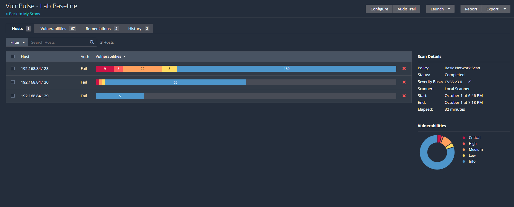
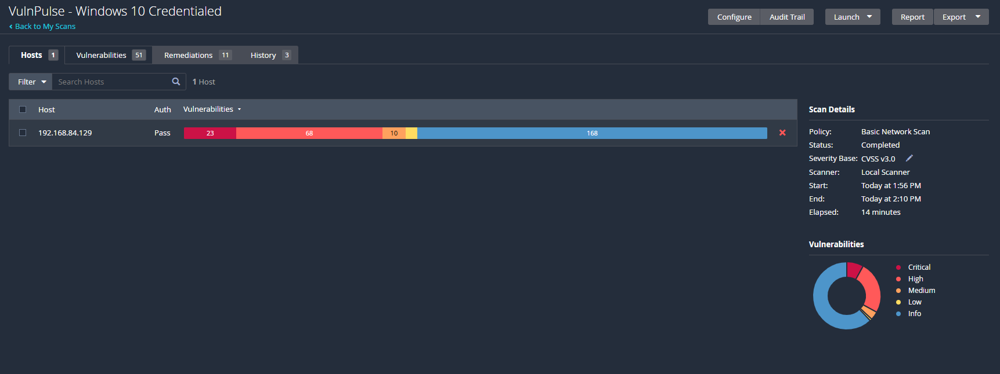
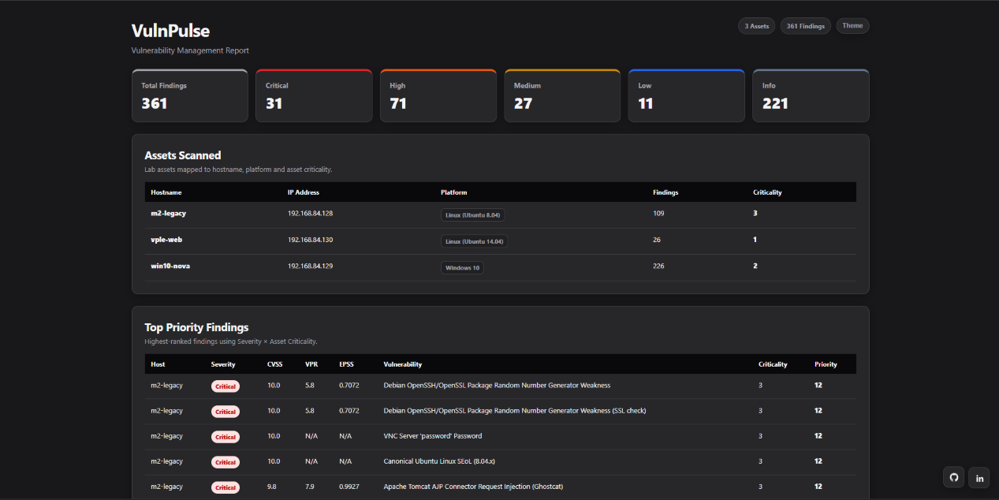
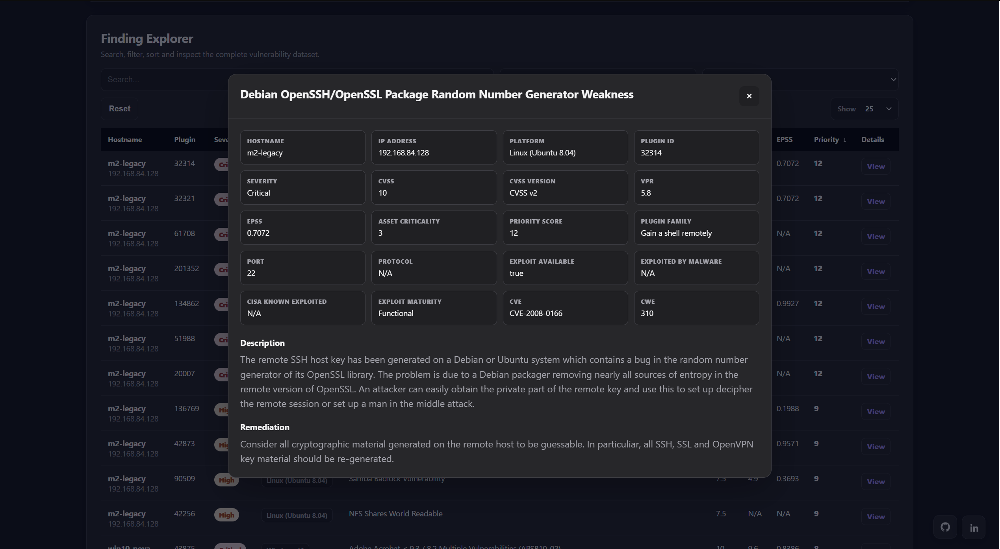

# VulnPulse

**VulnPulse is a Python-based vulnerability management pipeline that collects Nessus findings, organizes them by asset, prioritizes them using severity and asset criticality, and generates an interactive HTML security dashboard.**

I built VulnPulse as a hands-on cybersecurity lab project to understand how vulnerability management works beyond simply running a vulnerability scanner.

The main idea is simple:

> **Collect vulnerabilities → understand the affected asset → prioritize the findings → present the results in a useful way.**

---

# What Problem Does VulnPulse Solve?

A vulnerability scanner can generate a large amount of security data.

For example, a scan may return hundreds of findings.

Looking only at the raw scanner output makes it difficult to answer questions like:

- Which system is affected?
- How severe is the finding?
- How important is that system?
- Which vulnerabilities should be reviewed first?
- How can the results be presented in a way that is easy to understand?

VulnPulse adds a small management layer on top of Nessus.

It takes the scanner data and turns it into a structured security report.

---

# VulnPulse Workflow

The complete workflow is:

```text
                   Nessus
                     |
                     v
             Scan results
                     |
                     v
        Host-specific vulnerability data
                     |
                     v
            Python parser
                     |
                     v
        Normalize vulnerability data
                     |
                     v
        Add asset / platform context
                     |
                     v
          Calculate priority score
                     |
                     v
          Generate CSV + HTML report
                     |
                     v
          Interactive security dashboard
```

For the consolidated dashboard, VulnPulse combines the data from the lab scans into one view.

```text
VulnPulse - Lab Baseline
        |
        +---- m2-legacy Linux findings
        |
        +---- vple-web Linux findings
        |
        +---- Windows baseline findings
                         |
                         X  replaced by credentialed results

VulnPulse - Windows 10 Credentialed
        |
        +---- win10-nova Windows findings
                         |
                         v
                Consolidated dataset
                         |
                         v
                VulnPulse dashboard
```
The Windows baseline findings are replaced by the credentialed Windows results in the consolidated dataset so that the same Windows findings are not counted twice.

---

# Key Features

## Nessus API Integration

VulnPulse connects to a local Nessus instance using the Nessus REST API.

The pipeline can:

- Connect to Nessus
- Find a scan by name
- Download scan results
- Retrieve host-specific vulnerability information
- Save raw Nessus results locally
- Process the findings automatically
- Generate the final reports

This removes the need to manually export and process vulnerability data every time.

---

### Nessus Scan

The vulnerability data used by VulnPulse comes from Nessus.


---

# Host-Specific Vulnerability Processing

VulnPulse processes vulnerability information per host.

This is important because a vulnerability without asset context is less useful.

Instead of only having:

```text
Apache vulnerability
```

the pipeline keeps information such as:

```text
Host
IP Address
Plugin ID
Severity
CVSS
VPR
EPSS
Platform
Remediation
```

together.

This makes the result easier to investigate.

---

# Vulnerability Normalization

The raw Nessus data is converted into a common structure before it is used by the rest of the pipeline.

VulnPulse extracts information such as:

- Hostname
- IP Address
- Plugin ID
- Vulnerability
- Severity
- Severity Score
- CVSS
- CVSS Version
- VPR
- EPSS
- Plugin Family
- Description
- Solution
- CVEs
- CWE
- Port
- Protocol
- Exploit Available
- Exploited By Malware
- CISA Known Exploited
- Exploit Maturity

This makes the scanner output easier to process, sort and report.

---

# Risk Prioritization

VulnPulse uses a simple risk-prioritization model.

```text
Priority Score =
Severity Score × Asset Criticality
```

### Severity score

```text
Critical = 4
High     = 3
Medium   = 2
Low      = 1
Info     = 0
```

### Asset criticality

For this lab:

```text
3 = higher importance
2 = medium importance
1 = lower importance
```

For example:

```text
Critical finding
Severity Score = 4

Asset Criticality = 3

Priority Score = 4 × 3
               = 12
```

The purpose of this model is to show a simple example of risk-based prioritization.

It is not meant to replace a complete enterprise risk model.

In a production environment, other factors could also be included such as:

- Business impact
- Internet exposure
- Exploit availability
- EPSS
- VPR
- CISA Known Exploited status
- Vulnerability age
- Patch availability
- Remediation SLA
- Existing compensating controls

---

# Credentialed Windows Assessment

The Windows 10 system in the lab was scanned using a credentialed Nessus configuration.

Credentialed scanning allows the scanner to inspect more information from the operating system and installed applications.

The Windows credentialed scan produced:

```text
226 findings
```


The dataset includes findings related to areas such as:

- Windows security updates
- Adobe Acrobat
- Microsoft .NET Framework
- 7-Zip
- WinRAR
- VLC
- WinSCP
- Other installed software and Windows configuration issues

The purpose of the credentialed scan in this project is to demonstrate how authenticated vulnerability assessment can provide deeper host visibility.

---

# Lab Environment

VulnPulse was built and tested in an isolated VMware lab.

```text
                         Windows Host
                              |
                       Host-only VMnet2
                       192.168.84.0/24
                              |
          +-------------------+-------------------+
          |                   |                   |
          v                   v                   v
   Metasploitable2         Windows 10             VPLE
   192.168.84.128        192.168.84.129      192.168.84.130
     m2-legacy              win10-nova           vple-web
```

## Lab Assets

| Hostname | IP Address | Platform | Asset Criticality | Findings |
|---|---|---|---:|---:|
| m2-legacy | 192.168.84.128 | Linux (Ubuntu 8.04) | 3 | 109 |
| win10-nova | 192.168.84.129 | Windows 10 | 2 | 226 |
| vple-web | 192.168.84.130 | Linux (Ubuntu 14.04) | 1 | 26 |

---

# Consolidated Results

The main VulnPulse dashboard uses the consolidated dataset.

The Linux findings come from the baseline scan.

The Windows findings come from the credentialed Windows scan.

This gives one dashboard for the complete lab:

```text
m2-legacy    → 109 findings
vple-web      → 26 findings
win10-nova   → 226 findings
--------------------------------
Total         → 361 findings
```

## Severity Summary

```text
Critical : 31
High     : 71
Medium   : 27
Low      : 11
Info     : 221
```

---

# Security Dashboard

VulnPulse generates an interactive HTML dashboard.




The dashboard contains:

## Summary Cards

The top of the dashboard shows:

- Total Findings
- Critical
- High
- Medium
- Low
- Info

---

## Assets Scanned

The asset table shows:

- Hostname
- IP Address
- Platform
- Findings
- Asset Criticality

This gives a quick view of which systems are part of the assessment.

---

## Top Priority Findings

The dashboard shows the highest-priority findings first.

The sorting is based on the priority score generated by VulnPulse.

This gives an analyst a quick starting point instead of asking them to read the complete raw scan output.

---

## Finding Explorer

The Finding Explorer is the main investigation area.

It supports:

- Search
- Host filtering
- Severity filtering
- Sorting
- Pagination
- Finding details

The sortable columns include:

```text
Hostname
Plugin
Severity
CVSS
VPR
EPSS
Priority
```

The selected sort column shows its current direction.

---

## Finding Details

Each finding can be opened from the dashboard to view additional technical information and remediation guidance.


The details view provides information such as:

- Hostname
- IP Address
- Platform
- Plugin ID
- Severity
- CVSS
- CVSS Version
- VPR
- EPSS
- Asset Criticality
- Priority Score
- Plugin Family
- Port
- Protocol
- Exploit Available
- Exploited By Malware
- CISA Known Exploited
- Exploit Maturity
- CVE
- CWE
- Description
- Remediation

---

# Dashboard Themes

The dashboard supports four themes:

```text
Light
Dark
Midnight
Graphite
```

The selected theme is stored in the browser.

---

# Technology Stack

## Security Tools

- Tenable Nessus Essentials
- VMware Workstation Pro

## Programming

- Python
- Pandas
- Requests
- Jinja2

## Testing

- Pytest

## Reporting

- HTML
- CSS
- JavaScript
- Jinja2 templates

## Version Control

- Git

---

# Project Structure

```text
Scan Report/
│
├── docs/
│   ├── images/
│   │   ├── nessus-scan.png
│   │   ├── nessus-windows-credentialed.png
│   │   ├── vulnpulse-dashboard.png
│   │   └── finding-details.png
│   └── report.html
│
├── Outputs/
│   ├── baseline_3host/
│   │   ├── prioritized_findings.csv
│   │   └── vulnerability_report.html
│   │
│   ├── windows10_credentialed/
│   │   ├── prioritized_findings.csv
│   │   └── vulnerability_report.html
│   │
│   └── consolidated/
│       ├── prioritized_findings.csv
│       └── vulnerability_report.html
│
├── Scans/
│   ├── baseline_3host.json
│   └── windows10_credentialed.json
│
├── src/
│   └── vulnpulse/
│       ├── __init__.py
│       ├── nessus.py
│       ├── parser.py
│       ├── pipeline.py
│       ├── report.py
│       └── risk.py
│
├── tests/
│   ├── __init__.py
│   ├── test_nessus.py
│   ├── test_parser.py
│   ├── test_report.py
│   └── test_risk.py
│
├── .env
├── .gitignore
├── info.md
├── pipeline.py
├── requirements.txt
└── README.md
```

---

# Code Structure

I kept the project separated into different modules so each part has one main responsibility.

### `nessus.py`

Handles communication with Nessus.

```text
Connect
Find scan
Download scan
Download host details
Save raw scan
```

### `parser.py`

Converts raw Nessus results into normalized vulnerability data.

### `risk.py`

Calculates the VulnPulse priority score.

### `report.py`

Prepares the data and renders the Jinja2 HTML template.

### `pipeline.py`

Connects the complete process together.

It supports:

```text
Individual Nessus scan processing
Consolidated report generation
CSV generation
HTML dashboard generation
```

---

# Running VulnPulse

## 1. Create / activate the virtual environment

Windows PowerShell:

```powershell
.venv\Scripts\Activate.ps1
```

---

## 2. Install dependencies

```powershell
pip install -r requirements.txt
```

---

# Run the Baseline Scan

```powershell
python pipeline.py --scan "VulnPulse - Lab Baseline"
```

This generates:

```text
Outputs\baseline_3host\
```

with:

```text
prioritized_findings.csv
vulnerability_report.html
```

---

# Run the Credentialed Windows Scan

```powershell
python pipeline.py --scan "VulnPulse - Windows 10 Credentialed"
```

This generates:

```text
Outputs\windows10_credentialed\
```

with:

```text
prioritized_findings.csv
vulnerability_report.html
```

---

# Build the Main VulnPulse Dashboard

The consolidated dashboard uses the saved baseline and credentialed datasets.

Run:

```powershell
python pipeline.py --scan "VulnPulse consolidated"
```

The main dashboard is generated here:

```text
Outputs\consolidated\vulnerability_report.html
```

Open it with:

```powershell
start .\Outputs\consolidated\vulnerability_report.html
```

---

# Testing

VulnPulse uses Pytest for automated testing.

Run:

```powershell
pytest -q
```

Current test result:

```text
23 passed
```

The tests cover areas such as:

- Nessus client behavior
- Vulnerability parsing
- Risk prioritization
- HTML report generation

---

# Secret Management

Nessus API credentials are stored in `.env`.

Example:

```env
NESSUS_URL=https://localhost:8834
NESSUS_ACCESS_KEY=<secret>
NESSUS_SECRET_KEY=<secret>
```

The real values are not stored in Git.

The following are excluded by `.gitignore`:

```text
.env
Scans/
Outputs/
.venv/
__pycache__/
```

This is important because security projects also need to protect their own credentials and sensitive scan data.

Raw vulnerability scan results can contain internal asset information, so they are kept outside the Git repository.

---

# Security Considerations

This project is built for a controlled lab environment.

The vulnerable virtual machines are intentionally insecure and are used for learning and testing.

The lab network is isolated from production systems.

Do not expose intentionally vulnerable machines to:

- Production networks
- Corporate networks
- Public Internet
- Systems that you do not own or have permission to test

Only perform vulnerability scanning where you have authorization.

---

# What I Learned

Building VulnPulse helped me understand that vulnerability management is bigger than just running a scanner.

The overall process is:

```text
Discover
   ↓
Collect
   ↓
Normalize
   ↓
Add asset context
   ↓
Prioritize
   ↓
Report
   ↓
Remediate
   ↓
Verify
```

Some of the main lessons from this project:

- Scanner output can contain a lot of information and still be difficult to use directly.
- Host context is important when working with vulnerabilities.
- Asset importance can change how findings should be prioritized.
- Credentialed scanning can provide deeper visibility into a host.
- Automation reduces repeated manual work.
- Raw security data should be handled carefully.
- A security report should help an analyst understand what to investigate next.

---

# Why the Project Is Called VulnPulse

The name comes from two simple ideas:

**Vuln** → Vulnerability

**Pulse** → A regular view of the security condition of an environment

The idea is that VulnPulse provides a quick security "pulse" of the lab environment by showing what vulnerabilities exist and how they are prioritized.

---

# Disclaimer

VulnPulse is a cybersecurity learning and portfolio project.

The project uses intentionally vulnerable virtual machines in an isolated lab environment.

Do not use the vulnerable systems or this project against systems without proper authorization.

---

# Author

**Dhruvesh Bawane**

IT Security Analyst | Cybersecurity

GitHub:
https://github.com/dhruveshbawane

LinkedIn:
https://www.linkedin.com/in/dhruvesh-bawane